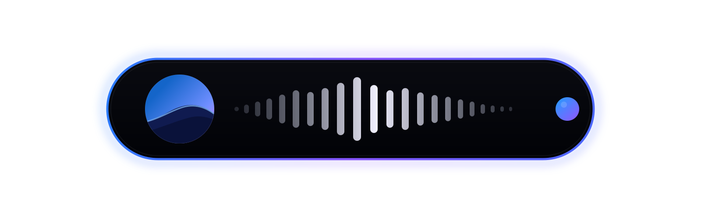

<p align="center">
  
</p>

<h1 align="center">Hevel</h1>

<p align="center">
  Hevel - A Dynamic Island for your MacBook's notch.<br>
  Ts vibecoeded as hell but free so who cares 🤑
</p>

## Install

1. Download `Hevel-x.y.z.dmg` from the [latest release](https://github.com/nokoniko/hevel/releases/latest) and open it.
2. Drag `Hevel.app` onto **Applications**.
3. First launch: right-click → **Open** (it isn't notarized, so macOS asks once).

After that it updates itself. Needs macOS 14+, an Apple Silicon Mac, and the Xcode Command Line Tools (`xcode-select --install`).

if you want to use it for windows go to https://github.com/bisonactual/Nikos-Dynamic-Island/ 

## What it does

- **Now playing** — album art peeks out left of the notch, a live equalizer on the right. Works with Spotify, Apple Music and browsers (YouTube, SoundCloud…). When nothing plays it's exactly notch-sized, so you don't see it.
- **Track changes** — the cover does a coin flip to reveal the new one.
- **Click to switch** — click the island to jump to the app that's playing. It hides while that app is in front, and in fullscreen.
- **Charging** — plug in and a ring fills up to your battery level.
- **Lock screen** — a lock icon next to the notch while the screen is locked.
- **Auto-updates** — only installs builds signed with the project's key. Menu bar icon → **Check for Updates…**
- **Settings** — menu bar icon → **Settings…** (⌘,): version and updates (how often and what time of day to check), launch at login, and each island feature on or off — with search.

Lives in the menu bar, no Dock icon, ~30 MB of RAM.

## Build from source

```bash
cd builder
cargo run
```

Builds `Hevel.app` and offers to move it to Applications. Needs Swift (Xcode Command Line Tools) and Rust. For quick iteration there's `swift run`, and if u r a lazy bum, `./build.sh`. Run the tests with `./test.sh` (see [TESTING.md](TESTING.md)).

## How it works

[ARCHITECTURE.md](ARCHITECTURE.md) is the full tour of the code base — also the right context to hand an AI if you want to keep vibecoding ts
